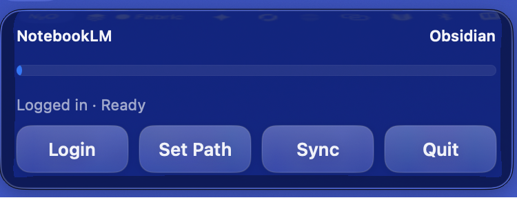

# NotebookLM-to-Obisidian

[](https://github.com/Fly-Carrot/NotebookLM-to-Obisidian/releases)


A minimal, one-click sync app from NotebookLM to Obsidian.



## What it does

- Menu bar app with 4 buttons: `Login`, `Set Path`, `Sync`, `Quit`
- Progress bar and status line
- Markdown cleanup for better readability
- Optional full overwrite strategy for changed notebooks

## Project structure

- `scripts/sync_notebooklm_to_obsidian.py`: sync engine
- `run_sync.sh`: CLI runner
- `mac_app_build/NotebookSyncApp.swift`: menu bar app source
- `Launchers/NotebookLM Obsidian Sync.app`: macOS app bundle
- `scripts/install_daily_launchd.sh`: schedule installer

## Quick start

```bash
cd "/Users/david_chen/Desktop/MCP_Hub/Obsidian Transfer"
./scripts/setup_env.sh
./Obsidian_Transfer_venv/bin/nlm login
./run_sync.sh --include-source-content --sync-images --skip-unchanged-notebooks --overwrite-changed-notebook --max-source-chars 0 --clean-markdown
```

## Launch app

```bash
./scripts/build_app.sh
./OPEN_SYNC_APP.command
```

## Install daily auto-sync

```bash
./scripts/install_daily_launchd.sh
```

## Security hardening included

- Download URLs restricted to `http/https`
- Atomic file writes for downloaded binaries
- Root-boundary guard before destructive notebook-folder overwrite
- Runtime checks for missing Python/script/vault path in app

## Notes

- This project syncs into your Obsidian vault path; it does not upload your notes to cloud services.
- If your Mac is asleep, sync waits until wake and next trigger interval.

## If macOS says the app is damaged

If you downloaded an older build, use the latest Release.  
If macOS still blocks launch, run:

```bash
xattr -dr com.apple.quarantine "/Applications/NotebookLM Obsidian Sync.app"
codesign --force --deep --sign - "/Applications/NotebookLM Obsidian Sync.app"
open "/Applications/NotebookLM Obsidian Sync.app"
```
