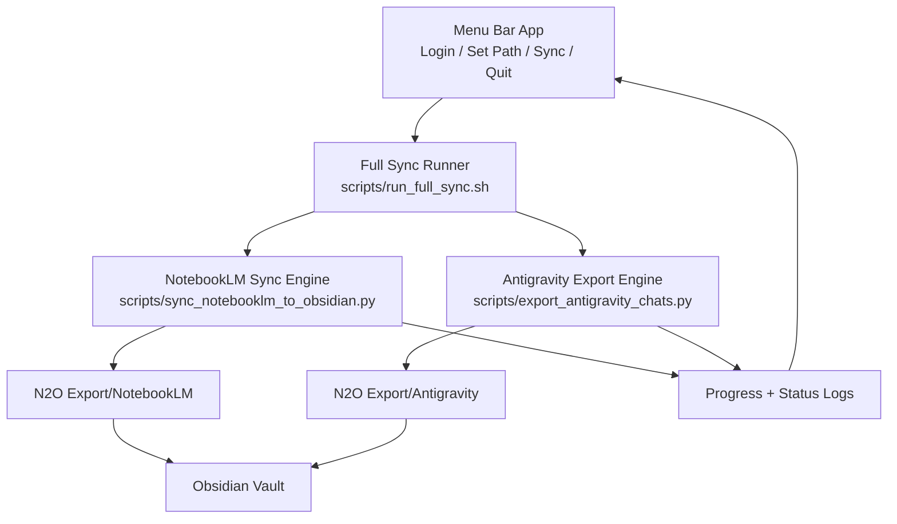

# NotebookLM-to-Obisidian

[English](README.md) | [简体中文](README.zh-CN.md)


[](https://github.com/Fly-Carrot/NotebookLM-to-Obisidian/releases)


A minimal, one-click sync app from NotebookLM to Obsidian.


## Sync Architecture


```mermaid
flowchart TD
    A["Menu Bar App<br/>Login / Set Path / Sync / Quit"] --> B["Full Sync Runner<br/>scripts/run_full_sync.sh"]
    B --> C["NotebookLM Sync Engine<br/>scripts/sync_notebooklm_to_obsidian.py"]
    B --> D["Antigravity Export Engine<br/>scripts/export_antigravity_chats.py"]
    C --> E["N2O Export/NotebookLM"]
    D --> F["N2O Export/Antigravity"]
    E --> G["Obsidian Vault"]
    F --> G
    C --> H["Progress + Status Logs"]
    D --> H
    H --> A
```

## Features

- Menu bar app with four actions: `Login`, `Set Path`, `Sync`, `Quit`
- One-click `Sync` runs NotebookLM sync + Antigravity chat export
- Progress bar and status line during sync
- Markdown normalization for better readability
- Unified output parent folder: `N2O Export/`

## Export Layout

```text
N2O Export/
  NotebookLM/
  Antigravity/
```

- Antigravity source conversations are discovered from `~/.gemini/antigravity/conversations/*.pb`
- Readable mirror files are preferred when available; otherwise metadata placeholders are generated

## Project Structure

- `scripts/sync_notebooklm_to_obsidian.py`: NotebookLM sync engine
- `scripts/export_antigravity_chats.py`: Antigravity export engine
- `scripts/run_full_sync.sh`: unified pipeline runner
- `run_sync.sh`: direct NotebookLM CLI runner
- `mac_app_build/NotebookSyncApp.swift`: menu bar app source
- `Launchers/NotebookLM Obsidian Sync.app`: built app bundle

## Quick Start

```bash
cd "/Users/david_chen/Desktop/MCP_Hub/Obsidian Transfer"
./scripts/setup_env.sh
./Obsidian_Transfer_venv/bin/nlm login
./run_sync.sh --include-source-content --sync-images --skip-unchanged-notebooks --overwrite-changed-notebook --max-source-chars 0 --clean-markdown
```

## Export Antigravity Chats

```bash
./scripts/export_antigravity_chats.py --vault-root "/Users/david_chen/Library/Mobile Documents/iCloud~md~obsidian/Documents/Obsidian Memory"
```

## Run Full Pipeline Manually

```bash
./scripts/run_full_sync.sh --vault-root "/Users/david_chen/Library/Mobile Documents/iCloud~md~obsidian/Documents/Obsidian Memory"
```

## Custom Antigravity Root

```bash
./scripts/export_antigravity_chats.py \
  --antigravity-root "$HOME/.gemini/antigravity" \
  --vault-root "/Users/david_chen/Library/Mobile Documents/iCloud~md~obsidian/Documents/Obsidian Memory"
```

## Build and Launch App

```bash
./scripts/build_app.sh
./OPEN_SYNC_APP.command
```

## Optional Local Scheduling

```bash
./scripts/install_daily_launchd.sh
```

## Security Hardening

- Download URLs are restricted to `http/https`
- Downloaded binaries use atomic file writes
- Destructive overwrite is protected by root-boundary checks
- Runtime checks validate Python, scripts, and vault paths before execution

## Notes

- This project writes only to your local Obsidian vault path
- If your Mac sleeps, scheduled jobs run after wake at the next trigger interval

## If macOS says the app is damaged

Use the latest release first. If launch is still blocked, run:

```bash
xattr -dr com.apple.quarantine "/Applications/NotebookLM Obsidian Sync.app"
codesign --force --deep --sign - "/Applications/NotebookLM Obsidian Sync.app"
open "/Applications/NotebookLM Obsidian Sync.app"
```

---

[English](README.md) | [简体中文](README.zh-CN.md)
