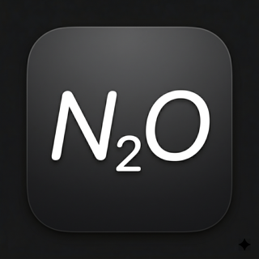
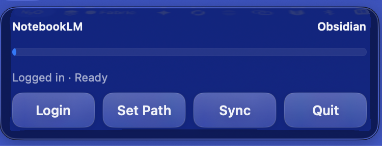
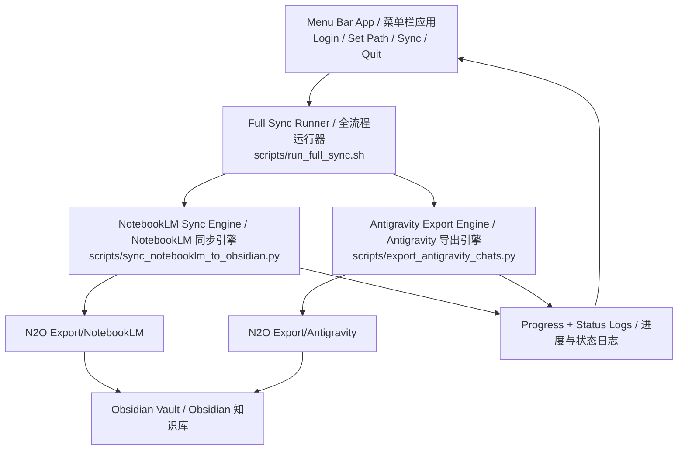

# NotebookLM-to-Obisidian

[English](README.en.md) | [Simplified Chinese](README.zh-CN.md)



[](https://github.com/Fly-Carrot/NotebookLM-to-Obisidian/releases)


A minimal, one-click sync app from NotebookLM to Obsidian.  
一个极简的一键同步工具：从 NotebookLM 同步到 Obsidian。



## Language Policy / 语言策略

- English and Chinese documentation is provided side-by-side across user-facing repository content.  
  仓库中面向用户阅读的核心内容均采用中英对照形式。
- The app interface itself remains English-only by product decision.  
  根据产品决策，应用界面本身保持英文，不做双语切换。

## Sync Architecture / 同步架构


```mermaid
flowchart TD
    A["Menu Bar App / 菜单栏应用<br/>Login / Set Path / Sync / Quit"] --> B["Full Sync Runner / 全流程运行器<br/>scripts/run_full_sync.sh"]
    B --> C["NotebookLM Sync Engine / NotebookLM 同步引擎<br/>scripts/sync_notebooklm_to_obsidian.py"]
    B --> D["Antigravity Export Engine / Antigravity 导出引擎<br/>scripts/export_antigravity_chats.py"]
    C --> E["N2O Export/NotebookLM"]
    D --> F["N2O Export/Antigravity"]
    E --> G["Obsidian Vault / Obsidian 知识库"]
    F --> G
    C --> H["Progress + Status Logs / 进度与状态日志"]
    D --> H
    H --> A
```

## Features / 核心功能

### English

- Menu bar app with four actions: `Login`, `Set Path`, `Sync`, `Quit`.
- One-click `Sync` runs both NotebookLM sync and Antigravity chat export.
- Progress bar and status line are shown during run.
- Markdown output is normalized for better readability.
- Unified output parent folder: `N2O Export/`.

### 中文

- 菜单栏应用提供四个操作：`Login`、`Set Path`、`Sync`、`Quit`。
- 一键 `Sync` 同时执行 NotebookLM 同步与 Antigravity 聊天导出。
- 同步过程中显示进度条与状态信息。
- 导出的 Markdown 会进行可读性清洗和规范化。
- 统一导出父目录为：`N2O Export/`。

## Export Layout / 导出结构

```text
N2O Export/
  NotebookLM/
  Antigravity/
```

### English

- Antigravity source conversations are discovered from `~/.gemini/antigravity/conversations/*.pb`.
- Readable mirror files are preferred when available; otherwise metadata placeholders are generated.

### 中文

- Antigravity 原始会话从 `~/.gemini/antigravity/conversations/*.pb` 扫描获取。
- 若存在可读镜像则优先导出；若不存在则生成元数据占位文件避免遗漏。

## Project Structure / 项目结构

- `scripts/sync_notebooklm_to_obsidian.py`: NotebookLM sync engine / NotebookLM 同步引擎
- `scripts/export_antigravity_chats.py`: Antigravity export engine / Antigravity 导出引擎
- `scripts/run_full_sync.sh`: unified pipeline runner / 一体化流程运行器
- `run_sync.sh`: direct NotebookLM CLI runner / NotebookLM 命令行入口
- `mac_app_build/NotebookSyncApp.swift`: menu bar app source / 菜单栏应用源码
- `Launchers/NotebookLM Obsidian Sync.app`: built app bundle / 已构建应用包

## Quick Start / 快速开始

### English

```bash
cd "/Users/david_chen/Desktop/MCP_Hub/Obsidian Transfer"
./scripts/setup_env.sh
./Obsidian_Transfer_venv/bin/nlm login
./run_sync.sh --include-source-content --sync-images --skip-unchanged-notebooks --overwrite-changed-notebook --max-source-chars 0 --clean-markdown
```

### 中文

```bash
cd "/Users/david_chen/Desktop/MCP_Hub/Obsidian Transfer"
./scripts/setup_env.sh
./Obsidian_Transfer_venv/bin/nlm login
./run_sync.sh --include-source-content --sync-images --skip-unchanged-notebooks --overwrite-changed-notebook --max-source-chars 0 --clean-markdown
```

## Export Antigravity Chats / 导出 Antigravity 聊天

### English

```bash
./scripts/export_antigravity_chats.py --vault-root "/Users/david_chen/Library/Mobile Documents/iCloud~md~obsidian/Documents/Obsidian Memory"
```

### 中文

```bash
./scripts/export_antigravity_chats.py --vault-root "/Users/david_chen/Library/Mobile Documents/iCloud~md~obsidian/Documents/Obsidian Memory"
```

## Run Full Pipeline Manually / 手动运行完整流程

### English

```bash
./scripts/run_full_sync.sh --vault-root "/Users/david_chen/Library/Mobile Documents/iCloud~md~obsidian/Documents/Obsidian Memory"
```

### 中文

```bash
./scripts/run_full_sync.sh --vault-root "/Users/david_chen/Library/Mobile Documents/iCloud~md~obsidian/Documents/Obsidian Memory"
```

## Custom Antigravity Root / 自定义 Antigravity 根路径

### English

```bash
./scripts/export_antigravity_chats.py \
  --antigravity-root "$HOME/.gemini/antigravity" \
  --vault-root "/Users/david_chen/Library/Mobile Documents/iCloud~md~obsidian/Documents/Obsidian Memory"
```

### 中文

```bash
./scripts/export_antigravity_chats.py \
  --antigravity-root "$HOME/.gemini/antigravity" \
  --vault-root "/Users/david_chen/Library/Mobile Documents/iCloud~md~obsidian/Documents/Obsidian Memory"
```

## Build and Launch App / 构建与启动应用

### English

```bash
./scripts/build_app.sh
./OPEN_SYNC_APP.command
```

### 中文

```bash
./scripts/build_app.sh
./OPEN_SYNC_APP.command
```

## Optional Local Scheduling / 可选本地定时

### English

```bash
./scripts/install_daily_launchd.sh
```

### 中文

```bash
./scripts/install_daily_launchd.sh
```

## Security Hardening / 安全加固

### English

- Download URLs are restricted to `http/https`.
- Downloaded binaries use atomic file writes.
- Destructive overwrite is protected by root-boundary checks.
- Runtime checks validate Python, scripts, and vault paths before execution.

### 中文

- 下载 URL 被严格限制为 `http/https`。
- 下载二进制文件时采用原子写入，减少损坏风险。
- 覆盖删除前会执行根路径边界保护检查。
- 运行前会校验 Python、脚本与 Vault 路径是否可用。

## Notes / 备注

### English

- This project writes only to your local Obsidian vault path.
- If your Mac sleeps, scheduled jobs run after wake at the next trigger interval.

### 中文

- 本项目仅写入你本地的 Obsidian Vault 路径。
- 若 Mac 进入休眠，定时任务会在唤醒后按下一触发时机执行。

## If macOS says the app is damaged / 如果 macOS 提示应用已损坏

### English

Use the latest release first. If launch is still blocked, run:

```bash
xattr -dr com.apple.quarantine "/Applications/NotebookLM Obsidian Sync.app"
codesign --force --deep --sign - "/Applications/NotebookLM Obsidian Sync.app"
open "/Applications/NotebookLM Obsidian Sync.app"
```

### 中文

请先优先下载最新 Release。如果仍被拦截，可执行：

```bash
xattr -dr com.apple.quarantine "/Applications/NotebookLM Obsidian Sync.app"
codesign --force --deep --sign - "/Applications/NotebookLM Obsidian Sync.app"
open "/Applications/NotebookLM Obsidian Sync.app"
```

---

[English](README.en.md) | [Simplified Chinese](README.zh-CN.md)
