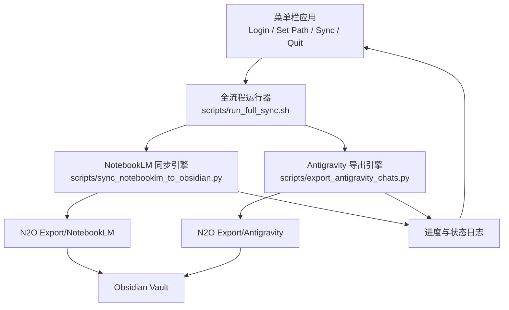

# NotebookLM-to-Obisidian

[English](README.md) | [简体中文](README.zh-CN.md)


[](https://github.com/Fly-Carrot/NotebookLM-to-Obisidian/releases)


一个极简的一键同步工具：从 NotebookLM 同步到 Obsidian。


## 同步架构



## 核心功能

- 菜单栏应用提供四个操作：`Login`、`Set Path`、`Sync`、`Quit`
- 一键 `Sync` 同时执行 NotebookLM 同步 + Antigravity 聊天导出
- 同步过程中显示进度条和状态信息
- 自动清洗 Markdown，提升可读性
- 统一导出父目录：`N2O Export/`

## 导出结构

```text
N2O Export/
  NotebookLM/
  Antigravity/
```

- Antigravity 原始会话路径：`~/.gemini/antigravity/conversations/*.pb`
- 若存在可读镜像优先导出；否则会生成元数据占位文件

## 项目结构

- `scripts/sync_notebooklm_to_obsidian.py`：NotebookLM 同步引擎
- `scripts/export_antigravity_chats.py`：Antigravity 导出引擎
- `scripts/run_full_sync.sh`：一体化流程运行器
- `run_sync.sh`：NotebookLM 命令行入口
- `mac_app_build/NotebookSyncApp.swift`：菜单栏应用源码
- `Launchers/NotebookLM Obsidian Sync.app`：已构建应用包

## 快速开始

```bash
cd "/Users/david_chen/Desktop/MCP_Hub/Obsidian Transfer"
./scripts/setup_env.sh
./Obsidian_Transfer_venv/bin/nlm login
./run_sync.sh --include-source-content --sync-images --skip-unchanged-notebooks --overwrite-changed-notebook --max-source-chars 0 --clean-markdown
```

## 导出 Antigravity 聊天

```bash
./scripts/export_antigravity_chats.py --vault-root "/Users/david_chen/Library/Mobile Documents/iCloud~md~obsidian/Documents/Obsidian Memory"
```

## 手动运行完整流程

```bash
./scripts/run_full_sync.sh --vault-root "/Users/david_chen/Library/Mobile Documents/iCloud~md~obsidian/Documents/Obsidian Memory"
```

## 自定义 Antigravity 根路径

```bash
./scripts/export_antigravity_chats.py \
  --antigravity-root "$HOME/.gemini/antigravity" \
  --vault-root "/Users/david_chen/Library/Mobile Documents/iCloud~md~obsidian/Documents/Obsidian Memory"
```

## 构建并启动应用

```bash
./scripts/build_app.sh
./OPEN_SYNC_APP.command
```

## 可选本地定时

```bash
./scripts/install_daily_launchd.sh
```

## 安全加固

- 下载 URL 严格限制为 `http/https`
- 下载二进制文件采用原子写入
- 覆盖删除前有根路径边界保护
- 运行前会校验 Python、脚本与 Vault 路径

## 备注

- 本项目仅写入本地 Obsidian Vault，不上传你的笔记
- 如果 Mac 休眠，定时任务会在唤醒后按下一触发时机执行

## 如果 macOS 提示应用已损坏

建议先下载最新 Release。若仍被拦截，执行：

```bash
xattr -dr com.apple.quarantine "/Applications/NotebookLM Obsidian Sync.app"
codesign --force --deep --sign - "/Applications/NotebookLM Obsidian Sync.app"
open "/Applications/NotebookLM Obsidian Sync.app"
```

---

[English](README.md) | [简体中文](README.zh-CN.md)
